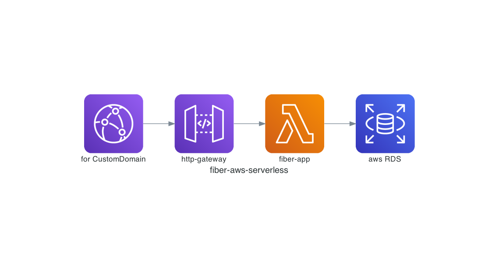

# fiber-aws-serverless

this is fiber aws serverless example source code. it uses a [serverless framework](https://www.serverless.com/), It's more simple serverless framework than AWS SAM or CDK for beginners.

> Sorry AWS, Cheer up. I bought your stocks.

# structure

#### core libraries

- [gorm (for manipulate DB)](https://gorm.io/index.html)
- [fiber(for http application)](https://gofiber.io)
- [cobra (for cli application)](https://github.com/spf13/cobra)
- [serverless framework tool](https://www.serverless.com)

#### project

``` text
📦fiber-aws-serverless 
 ┣ 📂client
 ┣ 📂node_modules
 ┣ 📂server
 ┃ ┗ 📜index.js
 ┣ 📜.gitignore
 ┣ 📜package-lock.json
 ┗ 📜package.json
```

#### aws architecture




# Getting Start

### requirements

``` bash
npm install -g serverless
```


``` bash
# start server at local
go run main.go start

# deploy
make deploy
```

# references
- documentation tools: [mingrammers/diagrams](https://github.com/mingrammer/diagrams)