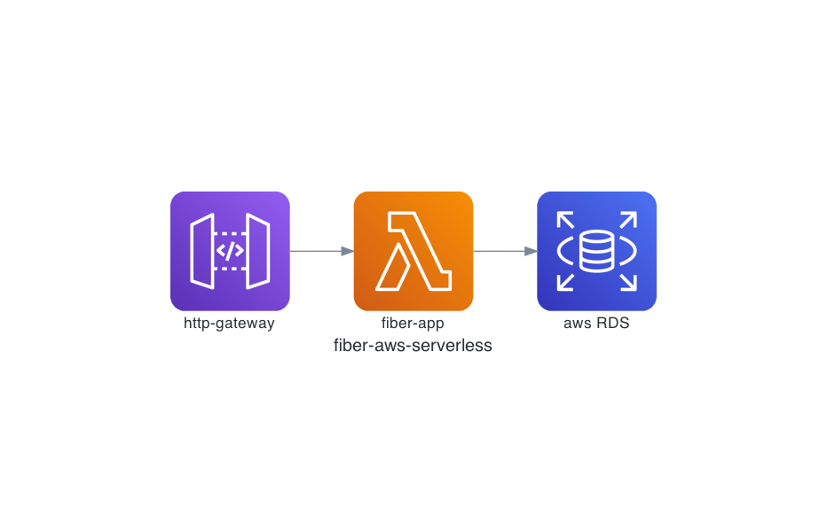

# fiber-aws-serverless

this is fiber aws serverless example source code. it uses a [serverless framework](https://www.serverless.com/), It's more simple serverless framework than AWS SAM or CDK for beginners.

> Sorry AWS, Cheer up. I bought your stocks.

# structure

#### core libraries

- [gorm (for manipulate DB)](https://gorm.io/index.html)
- [fiber(for http application)](https://gofiber.io)
- [cobra (for cli application)](https://github.com/spf13/cobra)
- [serverless framework tool](https://www.serverless.com)

#### project

``` text
📦fiber-aws-serverless 
 ┣ 📂cmd
 ┣ 📂config
 ┣ 📂db
 ┣ 📂docs
 ┣ 📂model
 ┣ 📂lambda
 ┣ 📂internal
 ┃ ┗ 📜main.go      # for serverless main.go
 ┣ 📜main.go        # for dockerize or cli
 ┣ 📜.enc           # It's important, It must have secrets.
 ┣ 📜serverless.yml # it's deploy tool for aws serverless lambda for http
```

#### aws architecture




# Getting Start

### requirements

``` bash
npm install -g serverless serverless-dotenv-plugin
```

### useful commands

``` bash
# start server at local
go run main.go http start

# initialize DB
go run main.go gorm init

# deploy
make deploy

# generate docs
make docs

# tail cloudwatchlogs realtime
aws logs tail ${cloudwatch-log-group} --follow

```

# API test

see [docs/todo.http](./docs/todo.http)


# references
- documentation tools: [mingrammers/diagrams](https://github.com/mingrammer/diagrams)